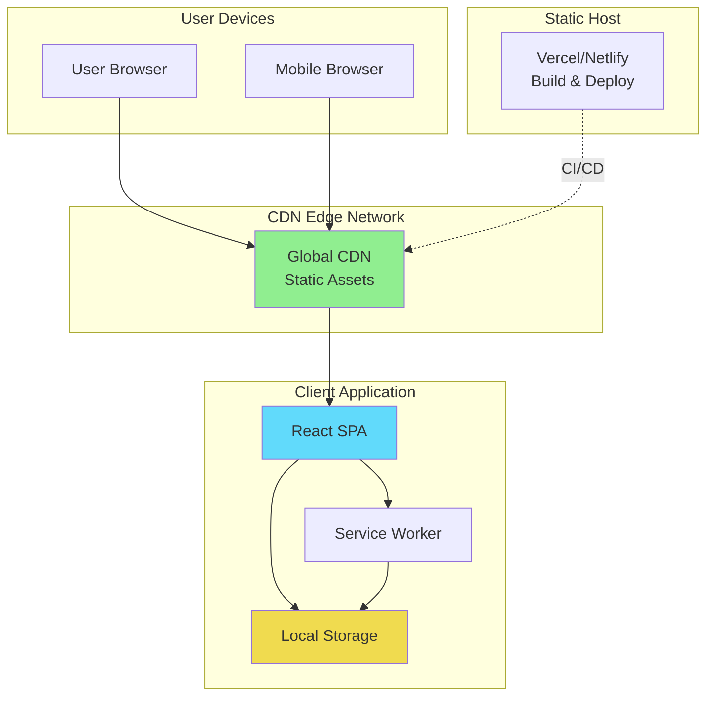
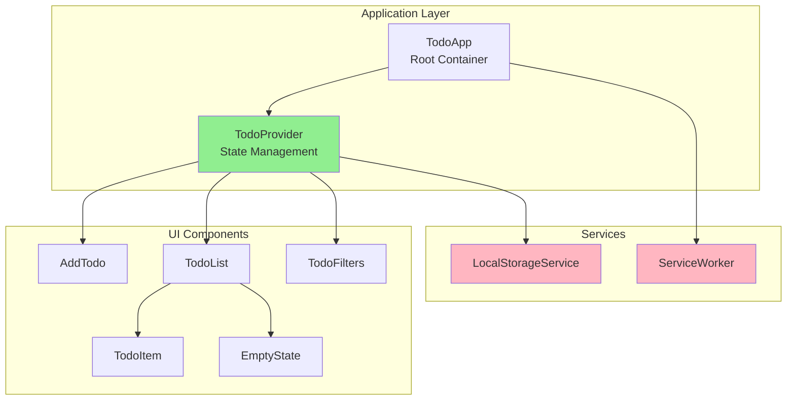
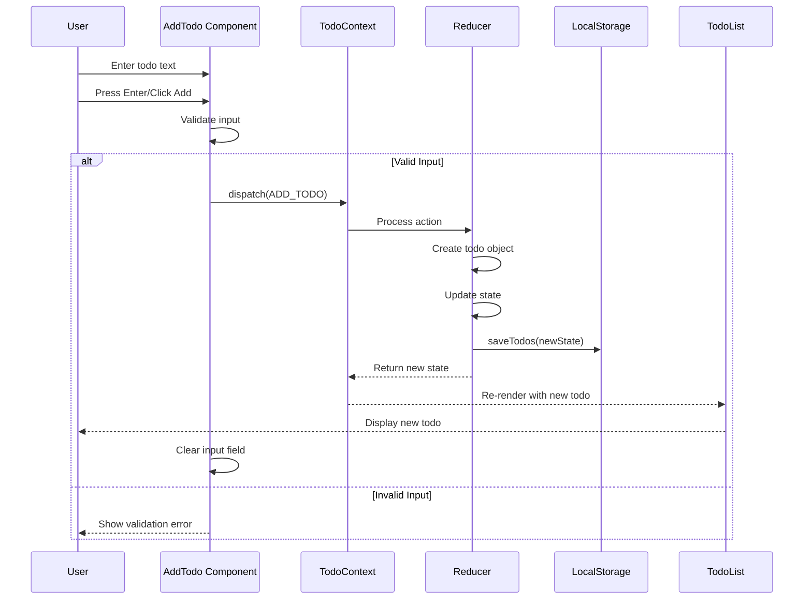
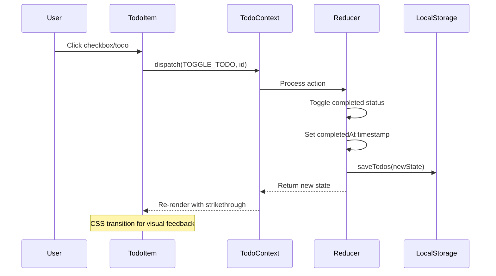
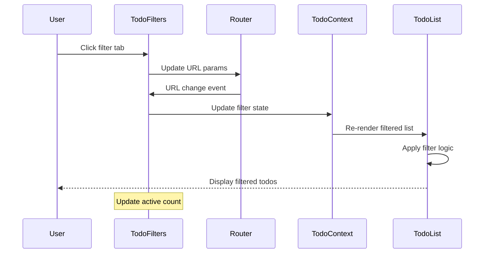
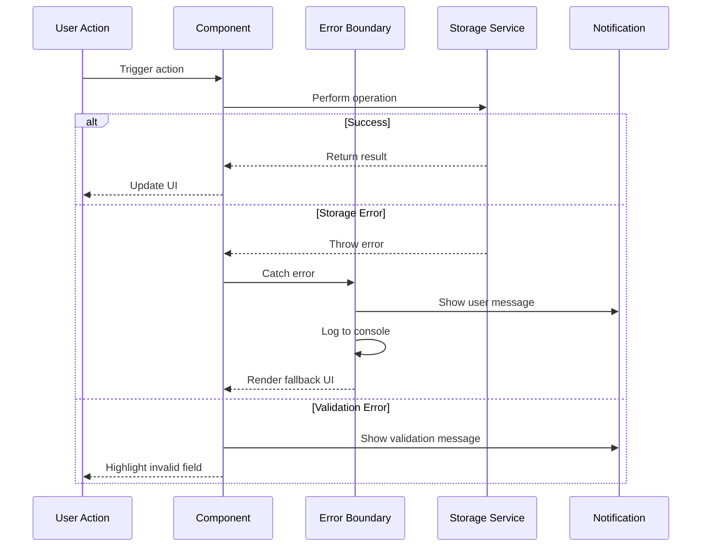

# Simple Todo App Fullstack Architecture Document

## Introduction

This document outlines the complete fullstack architecture for the Simple Todo App, including backend systems, frontend implementation, and their integration. It serves as the single source of truth for AI-driven development, ensuring consistency across the entire technology stack.

This unified approach combines what would traditionally be separate backend and frontend architecture documents, streamlining the development process for modern fullstack applications where these concerns are increasingly intertwined.

### Starter Template or Existing Project

**N/A - Greenfield project**

The Simple Todo App is a greenfield project with no existing codebase or starter template dependencies. This provides complete flexibility in architectural decisions while focusing on simplicity and modern best practices.

### Change Log

| Date | Version | Description | Author |
|------|---------|-------------|--------|
| 2025-01-20 | 1.0 | Initial architecture document creation | Winston (Architect) |

## High Level Architecture

### Technical Summary

The Simple Todo App is built as a client-side Single Page Application (SPA) using React with TypeScript, deployed as a static site with PWA capabilities. The architecture emphasizes simplicity and performance, utilizing browser local storage for data persistence without requiring a backend server. The application leverages modern build tools (Vite) for optimal development experience and production performance, with React Context API managing application state efficiently. This serverless approach achieves the PRD goals of delivering a fast, reliable, and accessible todo management tool while maintaining the flexibility to add backend services in the future if needed.

### Platform and Infrastructure Choice

**Platform:** Static Site Hosting (Vercel/Netlify)
**Key Services:**
- Static Site Hosting with automatic deployments
- CDN for global distribution
- Automatic HTTPS certificates
- Preview deployments for PRs

**Deployment Host and Regions:** Global CDN with automatic edge distribution

### Repository Structure

**Structure:** Monorepo (prepared for future expansion)
**Monorepo Tool:** npm workspaces (simple, built-in)
**Package Organization:** Single app package initially, with structure ready for shared packages when backend is added

### High Level Architecture Diagram



### Architectural Patterns

- **Jamstack Architecture:** Static site generation with client-side interactivity - _Rationale:_ Optimal performance, security, and scalability for a todo app without backend requirements
- **Component-Based UI:** Reusable React components with TypeScript - _Rationale:_ Maintainability, type safety, and clear separation of concerns
- **Container/Presentational Pattern:** Separate business logic from UI components - _Rationale:_ Testability and reusability of components
- **Context + Reducer Pattern:** Centralized state management using React Context API with useReducer - _Rationale:_ Predictable state updates without external dependencies
- **Service Worker Caching:** Offline-first approach with intelligent caching - _Rationale:_ PWA requirements and reliable offline functionality
- **Atomic Design Principles:** UI components organized from atoms to organisms - _Rationale:_ Scalable component architecture that promotes reusability

## Tech Stack

### Technology Stack Table

| Category | Technology | Version | Purpose | Rationale |
|----------|------------|---------|---------|-----------|
| Frontend Language | TypeScript | 5.3+ | Type-safe JavaScript | Type safety, better IDE support, self-documenting code |
| Frontend Framework | React | 18.2+ | UI component library | Industry standard, excellent ecosystem, hooks paradigm |
| UI Component Library | None (Custom) | - | Custom components | Keep bundle size minimal for simple todo app |
| State Management | React Context API | Built-in | Application state | Sufficient for app complexity, no external dependencies |
| Backend Language | N/A | - | No backend required | Local storage persistence as per PRD |
| Backend Framework | N/A | - | No backend required | Client-side only application |
| API Style | N/A | - | No API needed | Local storage persistence |
| Database | Browser localStorage | HTML5 | Data persistence | Zero-setup persistence, meets requirements |
| Cache | Service Worker Cache | PWA | Offline support | Required for PWA functionality |
| File Storage | N/A | - | No file storage needed | Text-based todos only |
| Authentication | N/A | - | No auth required | Single-user local application |
| Frontend Testing | Jest | 29+ | Unit testing | React standard, good TS support |
| Backend Testing | N/A | - | No backend | No backend to test |
| E2E Testing | Playwright | 1.40+ | End-to-end testing | Modern, reliable, good debugging |
| Build Tool | Vite | 5.0+ | Development and bundling | Fast HMR, optimized builds |
| Bundler | Rollup (via Vite) | Built-in | Production bundling | Tree-shaking, code splitting |
| IaC Tool | N/A | - | Static hosting | No infrastructure to manage |
| CI/CD | GitHub Actions | Latest | Automated deployment | Free for public repos, good integration |
| Monitoring | N/A | - | Basic only | Console errors sufficient for simple app |
| Logging | Browser Console | Native | Development logging | Built-in, sufficient for debugging |
| CSS Framework | CSS Modules | Built-in | Scoped styling | No global conflicts, good DX |

## Data Models

### Todo

**Purpose:** Core entity representing a single todo item with all its properties and state

**Key Attributes:**
- id: string - Unique identifier (UUID v4)
- title: string - Main todo text (required, max 200 chars)
- description: string - Optional detailed description (max 1000 chars)
- completed: boolean - Completion status
- createdAt: string - ISO 8601 timestamp of creation
- completedAt: string | null - ISO 8601 timestamp when completed
- order: number - Position in list for manual ordering

#### TypeScript Interface

```typescript
interface Todo {
  id: string;
  title: string;
  description?: string;
  completed: boolean;
  createdAt: string;
  completedAt: string | null;
  order: number;
}
```

#### Relationships
- Self-referential for ordering (order field determines position)
- No external relationships (single entity system)

### TodoFilter

**Purpose:** Represents the current filter state for displaying todos

**Key Attributes:**
- status: FilterStatus - Current filter (all | active | completed)
- searchTerm: string - Optional search text

#### TypeScript Interface

```typescript
type FilterStatus = 'all' | 'active' | 'completed';

interface TodoFilter {
  status: FilterStatus;
  searchTerm?: string;
}
```

#### Relationships
- Applied to Todo list for filtering
- Persisted in URL for bookmarking

## API Specification

**N/A - No API Required**

This application uses browser localStorage for persistence and does not require any backend API. All data operations are handled client-side through a service layer that interfaces with localStorage.

## Components

### TodoApp (Root Container)

**Responsibility:** Main application container managing global state, routing, and top-level error boundaries

**Key Interfaces:**
- Provides TodoContext to child components
- Manages keyboard shortcuts
- Handles PWA installation prompts

**Dependencies:** All child components, TodoContext, LocalStorageService

**Technology Stack:** React 18, TypeScript, Context API

### TodoProvider (State Management)

**Responsibility:** Centralized state management for all todo operations using Context API with useReducer

**Key Interfaces:**
- TodoContext.Provider with state and dispatch
- Actions: ADD_TODO, UPDATE_TODO, DELETE_TODO, TOGGLE_TODO, REORDER_TODOS, CLEAR_COMPLETED
- Persistence sync with localStorage

**Dependencies:** LocalStorageService

**Technology Stack:** React Context API, useReducer hook

### TodoList (Display Component)

**Responsibility:** Renders the filtered list of todos with virtualization for performance

**Key Interfaces:**
- Receives filtered todos from context
- Handles drag-and-drop reordering
- Manages todo item selection

**Dependencies:** TodoItem, TodoContext, DragDropContext

**Technology Stack:** React, react-window (for virtualization), @dnd-kit/sortable

### TodoItem (Interactive Component)

**Responsibility:** Individual todo display with inline editing and actions

**Key Interfaces:**
- Edit mode toggle
- Complete/uncomplete action
- Delete with confirmation
- Drag handle for reordering

**Dependencies:** TodoContext (for actions), ConfirmDialog

**Technology Stack:** React, CSS Modules for styling

### AddTodo (Input Component)

**Responsibility:** Form for creating new todos with validation

**Key Interfaces:**
- Controlled input components
- Form validation
- Submit handler

**Dependencies:** TodoContext (for ADD_TODO action)

**Technology Stack:** React, controlled components pattern

### TodoFilters (Navigation Component)

**Responsibility:** Filter tabs and search functionality

**Key Interfaces:**
- Filter state management
- URL synchronization
- Active count display

**Dependencies:** TodoContext, React Router (for URL sync)

**Technology Stack:** React, React Router hooks

### LocalStorageService (Data Layer)

**Responsibility:** Abstraction layer for localStorage operations with error handling

**Key Interfaces:**
- getTodos(): Todo[]
- saveTodos(todos: Todo[]): void
- migrate(): void (for schema updates)

**Dependencies:** None (pure TypeScript)

**Technology Stack:** TypeScript, localStorage API

### ServiceWorker (PWA Support)

**Responsibility:** Offline functionality and caching strategy

**Key Interfaces:**
- Cache static assets
- Network-first for data
- Background sync for future features

**Dependencies:** Workbox (for easier SW management)

**Technology Stack:** Service Worker API, Workbox

### Component Diagram



## External APIs

**N/A - No External APIs Required**

The Simple Todo App operates entirely client-side without external service dependencies. All functionality is self-contained within the application.

## Core Workflows

### Add Todo Workflow



### Complete Todo Workflow



### Filter Todos Workflow



## Database Schema

### localStorage Schema

```javascript
// Key: "todos"
// Value: JSON string of Todo array
{
  "version": "1.0",
  "todos": [
    {
      "id": "uuid-v4-string",
      "title": "string (required)",
      "description": "string (optional)",
      "completed": false,
      "createdAt": "2025-01-20T10:00:00.000Z",
      "completedAt": null,
      "order": 0
    }
  ],
  "lastModified": "2025-01-20T10:00:00.000Z"
}

// Key: "todo-settings"
// Value: JSON string of settings
{
  "filter": "all" | "active" | "completed",
  "sortOrder": "manual" | "created" | "alphabetical"
}
```

## Frontend Architecture

### Component Architecture

#### Component Organization

```text
src/components/
├── atoms/
│   ├── Button/
│   │   ├── Button.tsx
│   │   ├── Button.module.css
│   │   └── Button.test.tsx
│   ├── Input/
│   ├── Checkbox/
│   └── Icon/
├── molecules/
│   ├── TodoItem/
│   │   ├── TodoItem.tsx
│   │   ├── TodoItem.module.css
│   │   └── TodoItem.test.tsx
│   ├── TodoFilters/
│   ├── AddTodoForm/
│   └── ConfirmDialog/
├── organisms/
│   ├── TodoList/
│   ├── TodoHeader/
│   └── TodoFooter/
└── templates/
    └── TodoLayout/
```

#### Component Template

```typescript
import React, { memo } from 'react';
import styles from './ComponentName.module.css';

interface ComponentNameProps {
  // Props interface
  className?: string;
}

export const ComponentName = memo<ComponentNameProps>(({
  className
}) => {
  // Component logic

  return (
    <div className={`${styles.container} ${className || ''}`}>
      {/* Component JSX */}
    </div>
  );
});

ComponentName.displayName = 'ComponentName';
```

### State Management Architecture

#### State Structure

```typescript
interface TodoState {
  todos: Todo[];
  filter: TodoFilter;
  isLoading: boolean;
  error: string | null;
}

type TodoAction =
  | { type: 'ADD_TODO'; payload: Omit<Todo, 'id' | 'createdAt' | 'order'> }
  | { type: 'UPDATE_TODO'; payload: { id: string; updates: Partial<Todo> } }
  | { type: 'DELETE_TODO'; payload: string }
  | { type: 'TOGGLE_TODO'; payload: string }
  | { type: 'REORDER_TODOS'; payload: string[] }
  | { type: 'CLEAR_COMPLETED' }
  | { type: 'SET_FILTER'; payload: FilterStatus }
  | { type: 'LOAD_TODOS'; payload: Todo[] }
  | { type: 'SET_ERROR'; payload: string };
```

#### State Management Patterns
- Single source of truth via Context
- Immutable state updates
- Action-based state modifications
- Optimistic UI updates with rollback on error
- Middleware pattern for side effects (localStorage sync)

### Routing Architecture

#### Route Organization

```text
/ (root)
├── /#/all (default view)
├── /#/active (active todos)
└── /#/completed (completed todos)
```

#### Protected Route Pattern

```typescript
// Not applicable - no authentication required
// URL hash routing for filter state persistence
export const useFilterRoute = () => {
  const [filter, setFilter] = useState<FilterStatus>('all');

  useEffect(() => {
    const handleHashChange = () => {
      const hash = window.location.hash.slice(2) || 'all';
      setFilter(hash as FilterStatus);
    };

    window.addEventListener('hashchange', handleHashChange);
    handleHashChange();

    return () => window.removeEventListener('hashchange', handleHashChange);
  }, []);

  return filter;
};
```

### Frontend Services Layer

#### API Client Setup

```typescript
// LocalStorageService.ts
class LocalStorageService {
  private readonly STORAGE_KEY = 'todos';
  private readonly VERSION = '1.0';

  getTodos(): Todo[] {
    try {
      const data = localStorage.getItem(this.STORAGE_KEY);
      if (!data) return [];

      const parsed = JSON.parse(data);
      if (parsed.version !== this.VERSION) {
        this.migrate(parsed);
      }

      return parsed.todos || [];
    } catch (error) {
      console.error('Failed to load todos:', error);
      return [];
    }
  }

  saveTodos(todos: Todo[]): void {
    try {
      const data = {
        version: this.VERSION,
        todos,
        lastModified: new Date().toISOString()
      };

      localStorage.setItem(this.STORAGE_KEY, JSON.stringify(data));
    } catch (error) {
      if (error.name === 'QuotaExceededError') {
        throw new Error('Storage quota exceeded');
      }
      throw error;
    }
  }

  private migrate(data: any): void {
    // Handle future migrations
    console.log('Migrating data from version:', data.version);
  }
}

export const storageService = new LocalStorageService();
```

#### Service Example

```typescript
// TodoService.ts
import { storageService } from './LocalStorageService';
import { v4 as uuidv4 } from 'uuid';

export class TodoService {
  static createTodo(title: string, description?: string): Todo {
    const todos = storageService.getTodos();
    const maxOrder = Math.max(...todos.map(t => t.order), -1);

    const newTodo: Todo = {
      id: uuidv4(),
      title,
      description,
      completed: false,
      createdAt: new Date().toISOString(),
      completedAt: null,
      order: maxOrder + 1
    };

    return newTodo;
  }

  static validateTodo(todo: Partial<Todo>): string[] {
    const errors: string[] = [];

    if (!todo.title?.trim()) {
      errors.push('Title is required');
    }

    if (todo.title && todo.title.length > 200) {
      errors.push('Title must be less than 200 characters');
    }

    if (todo.description && todo.description.length > 1000) {
      errors.push('Description must be less than 1000 characters');
    }

    return errors;
  }
}
```

## Backend Architecture

**N/A - Client-Side Only Application**

The Simple Todo App does not require backend architecture as it operates entirely in the browser using localStorage for persistence. Future backend considerations would include:
- RESTful API for cloud sync
- User authentication system
- Real-time collaboration features
- Data backup and recovery

## Unified Project Structure

```plaintext
simple-todo-app/
├── .github/                    # CI/CD workflows
│   └── workflows/
│       ├── ci.yaml            # Test and lint
│       └── deploy.yaml        # Deploy to hosting
├── public/                    # Static assets
│   ├── index.html
│   ├── manifest.json          # PWA manifest
│   ├── favicon.ico
│   └── icons/                # PWA icons
├── src/
│   ├── components/            # React components
│   │   ├── atoms/
│   │   ├── molecules/
│   │   ├── organisms/
│   │   └── templates/
│   ├── contexts/              # React contexts
│   │   └── TodoContext.tsx
│   ├── hooks/                 # Custom hooks
│   │   ├── useTodos.ts
│   │   ├── useLocalStorage.ts
│   │   └── useKeyboard.ts
│   ├── services/              # Business logic
│   │   ├── LocalStorageService.ts
│   │   └── TodoService.ts
│   ├── styles/                # Global styles
│   │   ├── globals.css
│   │   ├── variables.css
│   │   └── reset.css
│   ├── types/                 # TypeScript types
│   │   └── todo.ts
│   ├── utils/                 # Utilities
│   │   ├── constants.ts
│   │   └── helpers.ts
│   ├── App.tsx               # Root component
│   ├── main.tsx              # Entry point
│   └── sw.ts                 # Service worker
├── tests/                     # Test files
│   ├── unit/
│   ├── integration/
│   └── e2e/
├── .env.example              # Environment template
├── .eslintrc.json            # ESLint config
├── .gitignore
├── .prettierrc               # Prettier config
├── index.html                # HTML entry
├── package.json
├── tsconfig.json             # TypeScript config
├── vite.config.ts            # Vite config
└── README.md
```

## Development Workflow

### Local Development Setup

#### Prerequisites

```bash
# Required tools
node --version  # v18.0.0 or higher
npm --version   # v9.0.0 or higher

# Optional but recommended
git --version   # For version control
```

#### Initial Setup

```bash
# Clone repository
git clone <repository-url>
cd simple-todo-app

# Install dependencies
npm install

# Copy environment variables (if any)
cp .env.example .env.local

# Start development server
npm run dev
```

#### Development Commands

```bash
# Start all services
npm run dev           # Start Vite dev server on http://localhost:5173

# Start frontend only
npm run dev           # Same as above (no backend)

# Start backend only
# N/A - No backend

# Run tests
npm run test          # Run unit tests with Jest
npm run test:watch    # Run tests in watch mode
npm run test:coverage # Generate coverage report
npm run test:e2e      # Run Playwright E2E tests
```

### Environment Configuration

#### Required Environment Variables

```bash
# Frontend (.env.local)
# Currently no environment variables required
# Future additions might include:
# VITE_APP_VERSION=1.0.0
# VITE_ENABLE_PWA=true

# Backend (.env)
# N/A - No backend

# Shared
# N/A - No shared config needed
```

## Deployment Architecture

### Deployment Strategy

**Frontend Deployment:**
- **Platform:** Vercel (primary) / Netlify (alternative)
- **Build Command:** `npm run build`
- **Output Directory:** `dist`
- **CDN/Edge:** Automatic edge network distribution

**Backend Deployment:**
- **Platform:** N/A - No backend required
- **Build Command:** N/A
- **Deployment Method:** N/A

### CI/CD Pipeline

```yaml
# .github/workflows/deploy.yaml
name: Deploy to Production

on:
  push:
    branches: [main]
  pull_request:
    branches: [main]

jobs:
  test:
    runs-on: ubuntu-latest
    steps:
      - uses: actions/checkout@v3
      - uses: actions/setup-node@v3
        with:
          node-version: '18'
          cache: 'npm'

      - run: npm ci
      - run: npm run lint
      - run: npm run test
      - run: npm run build

      - name: Run E2E tests
        run: npm run test:e2e

  deploy:
    needs: test
    runs-on: ubuntu-latest
    if: github.ref == 'refs/heads/main'

    steps:
      - uses: actions/checkout@v3
      - uses: actions/setup-node@v3
        with:
          node-version: '18'
          cache: 'npm'

      - run: npm ci
      - run: npm run build

      - name: Deploy to Vercel
        uses: vercel/action@v3
        with:
          vercel-token: ${{ secrets.VERCEL_TOKEN }}
          vercel-org-id: ${{ secrets.VERCEL_ORG_ID }}
          vercel-project-id: ${{ secrets.VERCEL_PROJECT_ID }}
```

### Environments

| Environment | Frontend URL | Backend URL | Purpose |
|-------------|-------------|------------|---------|
| Development | http://localhost:5173 | N/A | Local development |
| Staging | https://todo-staging.vercel.app | N/A | Pre-production testing |
| Production | https://todo.vercel.app | N/A | Live environment |

## Security and Performance

### Security Requirements

**Frontend Security:**
- CSP Headers: `default-src 'self'; script-src 'self' 'unsafe-inline'; style-src 'self' 'unsafe-inline';`
- XSS Prevention: React's built-in escaping, no dangerouslySetInnerHTML usage
- Secure Storage: localStorage with JSON validation, no sensitive data stored

**Backend Security:**
- Input Validation: N/A (no backend)
- Rate Limiting: N/A (no backend)
- CORS Policy: N/A (no backend)

**Authentication Security:**
- Token Storage: N/A (no authentication)
- Session Management: N/A (no sessions)
- Password Policy: N/A (no user accounts)

### Performance Optimization

**Frontend Performance:**
- Bundle Size Target: < 150KB gzipped
- Loading Strategy: Code splitting by route, lazy loading for modals
- Caching Strategy: Service Worker with cache-first for assets, network-first for data

**Backend Performance:**
- Response Time Target: N/A (no backend)
- Database Optimization: Efficient localStorage access with debounced writes
- Caching Strategy: In-memory state with localStorage sync

## Testing Strategy

### Testing Pyramid

```text
        E2E Tests (10%)
       /          \
    Integration (30%)
   /              \
Component (60%)  Utils (60%)
```

### Test Organization

#### Frontend Tests

```text
tests/
├── unit/
│   ├── components/
│   │   ├── TodoItem.test.tsx
│   │   └── AddTodo.test.tsx
│   ├── hooks/
│   │   └── useTodos.test.ts
│   └── services/
│       └── LocalStorageService.test.ts
├── integration/
│   ├── TodoWorkflow.test.tsx
│   └── FilteringAndSorting.test.tsx
└── e2e/
    ├── todo-crud.spec.ts
    └── offline-mode.spec.ts
```

#### Backend Tests

```text
N/A - No backend to test
```

#### E2E Tests

```text
tests/e2e/
├── fixtures/
│   └── todos.json
├── pages/
│   └── TodoPage.ts
└── specs/
    ├── create-todo.spec.ts
    ├── complete-todo.spec.ts
    ├── filter-todos.spec.ts
    └── drag-drop.spec.ts
```

### Test Examples

#### Frontend Component Test

```typescript
// TodoItem.test.tsx
import { render, screen, fireEvent } from '@testing-library/react';
import { TodoItem } from '@/components/molecules/TodoItem';
import { TodoContext } from '@/contexts/TodoContext';

describe('TodoItem', () => {
  const mockTodo = {
    id: '1',
    title: 'Test todo',
    completed: false,
    createdAt: '2025-01-20T10:00:00Z',
    completedAt: null,
    order: 0
  };

  it('toggles completion status on click', () => {
    const mockDispatch = jest.fn();

    render(
      <TodoContext.Provider value={{ dispatch: mockDispatch }}>
        <TodoItem todo={mockTodo} />
      </TodoContext.Provider>
    );

    const checkbox = screen.getByRole('checkbox');
    fireEvent.click(checkbox);

    expect(mockDispatch).toHaveBeenCalledWith({
      type: 'TOGGLE_TODO',
      payload: '1'
    });
  });
});
```

#### Backend API Test

```typescript
// N/A - No backend API to test
```

#### E2E Test

```typescript
// create-todo.spec.ts
import { test, expect } from '@playwright/test';

test('creates a new todo', async ({ page }) => {
  await page.goto('/');

  // Add a new todo
  const input = page.getByPlaceholder('What needs to be done?');
  await input.fill('Buy groceries');
  await input.press('Enter');

  // Verify todo appears in list
  const todoItem = page.getByText('Buy groceries');
  await expect(todoItem).toBeVisible();

  // Verify it's saved to localStorage
  const todos = await page.evaluate(() => {
    const data = localStorage.getItem('todos');
    return data ? JSON.parse(data).todos : [];
  });

  expect(todos).toHaveLength(1);
  expect(todos[0].title).toBe('Buy groceries');
});
```

## Coding Standards

### Critical Fullstack Rules

- **Type Safety First:** All functions must have explicit TypeScript types - no 'any' types allowed
- **Component Purity:** React components must be pure functions with no side effects outside useEffect
- **State Immutability:** Never mutate state directly - always create new objects/arrays
- **Error Boundaries:** Wrap feature components in error boundaries to prevent full app crashes
- **Accessibility Required:** All interactive elements must have proper ARIA labels and keyboard support
- **Storage Validation:** Always validate data from localStorage before using it
- **Performance Budget:** Components re-rendering more than necessary must use React.memo
- **Test Coverage:** Minimum 80% coverage for utilities, 60% for components

### Naming Conventions

| Element | Frontend | Backend | Example |
|---------|----------|---------|---------|
| Components | PascalCase | - | `TodoItem.tsx` |
| Hooks | camelCase with 'use' | - | `useTodos.ts` |
| API Routes | - | kebab-case | `/api/todos` |
| Database Tables | - | snake_case | `todo_items` |

## Error Handling Strategy

### Error Flow



### Error Response Format

```typescript
interface AppError {
  error: {
    code: string;
    message: string;
    details?: Record<string, any>;
    timestamp: string;
    requestId: string;
  };
}
```

### Frontend Error Handling

```typescript
// ErrorBoundary.tsx
class ErrorBoundary extends React.Component<Props, State> {
  static getDerivedStateFromError(error: Error): State {
    return { hasError: true, error };
  }

  componentDidCatch(error: Error, errorInfo: ErrorInfo) {
    console.error('Error caught by boundary:', error, errorInfo);
    // Could send to monitoring service here
  }

  render() {
    if (this.state.hasError) {
      return (
        <div className="error-fallback">
          <h2>Something went wrong</h2>
          <button onClick={() => window.location.reload()}>
            Reload page
          </button>
        </div>
      );
    }

    return this.props.children;
  }
}
```

### Backend Error Handling

```typescript
// N/A - No backend error handling needed
```

## Monitoring and Observability

### Monitoring Stack

- **Frontend Monitoring:** Browser console for development, consider Sentry for production
- **Backend Monitoring:** N/A - No backend
- **Error Tracking:** Console errors in development, optional Sentry integration
- **Performance Monitoring:** Chrome DevTools, Lighthouse CI in pipeline

### Key Metrics

**Frontend Metrics:**
- Core Web Vitals
  - LCP < 2.5s
  - FID < 100ms
  - CLS < 0.1
- JavaScript errors
- localStorage quota usage
- React component render counts

**Backend Metrics:**
- N/A - No backend metrics

## Checklist Results Report

### Architecture Checklist Validation

✅ **Requirements Coverage:** All functional and non-functional requirements from PRD addressed
✅ **Technology Stack:** Defined and justified for all components
✅ **Data Models:** Core entities defined with TypeScript interfaces
✅ **Component Architecture:** Clear separation of concerns with atomic design
✅ **State Management:** Context API with reducer pattern specified
✅ **Testing Strategy:** Comprehensive testing pyramid defined
✅ **Security Considerations:** Client-side security measures documented
✅ **Performance Targets:** Clear metrics and optimization strategies
✅ **Deployment Pipeline:** CI/CD with automated testing and deployment
✅ **Error Handling:** Comprehensive error boundary and validation approach
✅ **Coding Standards:** Clear conventions for consistency
✅ **Development Workflow:** Complete setup and command documentation

## Next Steps

1. **Set up project repository** with the defined structure
2. **Initialize React application** with Vite and TypeScript
3. **Implement core data models** and localStorage service
4. **Build atomic components** starting with atoms and molecules
5. **Implement state management** with Context API
6. **Add routing** for filter states
7. **Implement PWA features** with service worker
8. **Set up testing framework** and write initial tests
9. **Configure CI/CD pipeline** with GitHub Actions
10. **Deploy to staging** environment for testing